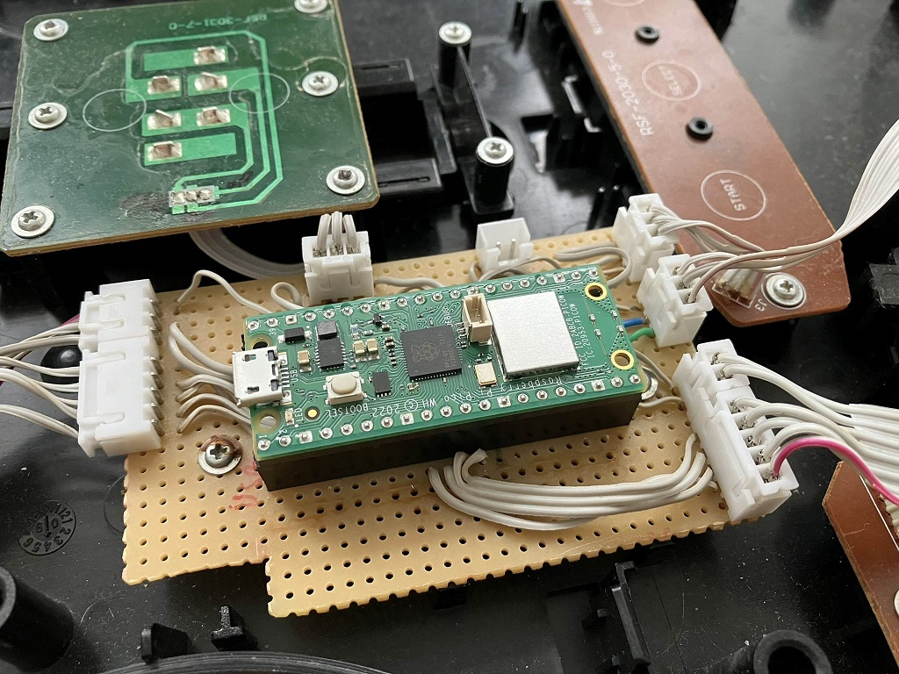

# Pico W bluetooth guitar
Same as my other project: [esp32-ble-guitar](https://github.com/1dle/esp32-ble-guitar), but for Raspberry Pi Pico W platform. Reuse old Guitar Hero controllers to work with PC through Bluetooth.

Took inspiration from this repo: [PicoGamepadConverter](https://github.com/Loc15/PicoGamepadConverter), to figure out how to emulate HID gamepad through bluetooth properly.

### Pinout

| Pico GPIO | Button |
| - | - |
| GP0 - GP4 | Frets |
| GP6 - GP9 | DPAD |
| GP18 | LED on DPAD |
| GP19, GP20 | Start, select |
| GP21, GP22  | Strums |
| GP27_A1 | Whammy potentiometer |
